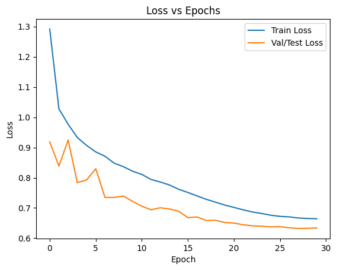
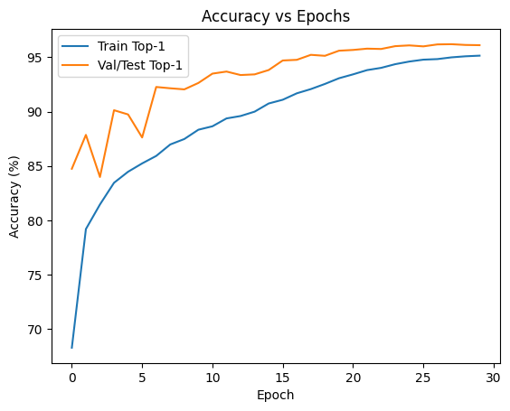
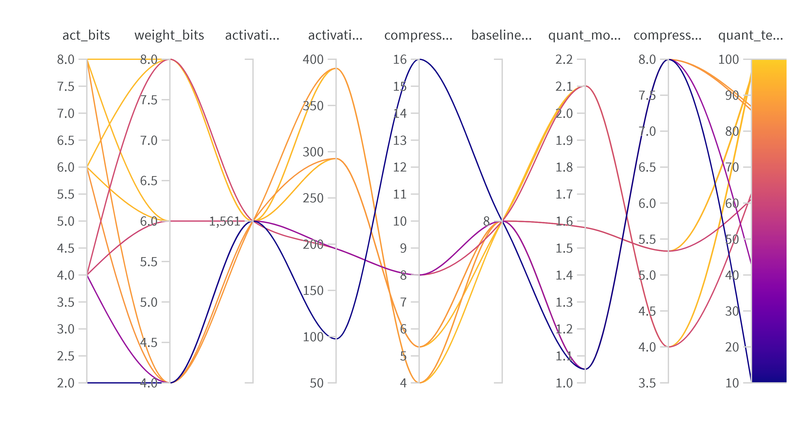

# CS6886W - System Engineering for DL - Assignment 3

 
 
 
 
 
 
 
 
 
 
 
 
 

### **Submitted By:** Adamaya Sharma  
### **Roll No:** cs24m501  
### **GitHub Link:** [https://github.com/Adamaya/cs6886w-assignment3](https://github.com/Adamaya/cs6886w-assignment3)

 
 
 
 
 
 
 
 
 
 
 
 
 
 

---
# Question 1 – Training Baseline

## (a) CIFAR-10 setup, normalization, and augmentation

To prepare the CIFAR-10 dataset, I used the standard torchvision loader, but since MobileNet-v2 expects ImageNet-sized inputs, I resized all images from 32×32 up to 224×224. That way, I didn't have to modify the model architecture itself.

For the training set, I applied a combination of augmentations to help the model generalize. I used a random resized crop (with a scale between 0.6 and 1.0) so the network sees objects at slightly different sizes, and a random horizontal flip as a simple way to add variability. I also added the AutoAugment policy designed for CIFAR-10, which applies a set of stronger, automatically-selected transformations. After converting images to tensors, I normalized them using ImageNet's mean and standard deviation—this keeps the input distribution consistent with what MobileNet-v2 was originally trained on. I also included Random Erasing with a 0.2 probability to make the model more robust to small occlusions.

For the test data, I kept things simple: resize → center crop → convert to tensor → apply the same normalization. No augmentation here, since the goal is to evaluate the model fairly.

## (b) MobileNet-v2 configuration and training strategy 

For the model, I used torchvision's built-in MobileNet-v2. By default, it loads ImageNet pretrained weights, which helps speed up training and usually gives better accuracy at the start. The only part I changed was the final classification layer so that it outputs 10 classes instead of 1000. Everything else stayed the same as the original MobileNet-v2: the width multiplier is the standard 1.0, the model keeps its usual dropout (about 0.2), and all the BatchNorm layers use their default settings.

On the training side, I used SGD with momentum (0.9) and Nesterov enabled, which is a pretty common setup for lightweight models like MobileNet. The initial learning rate was 0.05, and instead of keeping it constant, I used a cosine annealing schedule that gradually decreases the learning rate across epochs. Weight decay was set to 4e-5 but only applied to actual weight tensors—not biases or BatchNorm parameters—to avoid over-regularizing. For the loss, I used label smoothing with a smoothing factor of 0.1, which helps prevent the model from becoming overly confident about its predictions.

I trained for 30 epochs with a batch size of 128. If a GPU is available, mixed-precision training can be enabled, which makes the process faster and uses less memory. After each epoch, I evaluated the model on the test set and saved a checkpoint whenever it reached a new best accuracy, just to keep track of the best-performing version throughout training.

## (c) Final test accuracy(without compression), curves, and failure modes

The final and best test top-1 accuracy reached 96.21%, as recorded in the training log. The accuracy curve shows a steady climb for both training and validation, with validation accuracy leveling out around 96%. The loss curves also decrease smoothly and flatten toward the end, indicating the model converged well.

There are only a few minor failure modes. Early in training, validation accuracy jumps around due to strong data augmentation. Later on, a small gap forms between training and validation accuracy, which suggests light overfitting but nothing severe. The model may still struggle with visually similar CIFAR-10 classes (like cats vs. dogs), which is expected for MobileNet-v2. Overall, the learning behavior looks stable and healthy, with no major issues.

---

# Question 2. Model Compression Implementation

## (a) Compression method and design choices

For this project, I built a simple but flexible quantization-based compression system. The idea was to shrink both the model's weights and activations by reducing their precision, while keeping everything configurable so I could test different bit-widths easily.

### Weight compression

I quantize the weights of every Conv2d and Linear layer using per-channel symmetric quantization. This means each output channel gets its own scale value based on the maximum absolute weight in that channel. Then I round all weights to the nearest integer grid (based on the chosen bit-width) and convert them back to float so the model can still run normally in PyTorch.

Why per-channel? Because different channels often have very different ranges, and giving each channel its own scale usually preserves accuracy better than using a single scale for the whole tensor. I also made the bit-width configurable (--weight_bits), and added an optional flag (--exclude_first_last) to skip the very first and last layers, since those tend to be more sensitive.

### Activation compression

For activations, I take a simpler approach. Instead of fully quantizing activations during inference, I measure how much memory they would take at the chosen bit-width (--act_bits). This is done by hooking into the forward pass and counting how many activation values are produced by Conv/ReLU6/Linear layers. I then compute the memory usage for FP32 vs. lower precision.

This gives a good estimate of activation memory savings without needing to rewrite the entire network to run in integer mode.

Overall, the design keeps things controllable and easy to experiment with: bit-widths are adjustable, and both weights and activations are included in the compression story.

## (b) How compression is applied to MobileNet-v2

Once I load the MobileNet-v2 model and its trained checkpoint, I run my quantization function over all its Conv2d and Linear layers. For MobileNet-v2, that includes:

- the very first stem convolution,
- all depthwise convolutions inside the inverted residual blocks,
- all 1×1 pointwise convolutions, and
- the final fully connected classifier layer.

Unless the user explicitly chooses to skip the first and last layer, every single convolution and linear layer gets quantized.

For activations, I attach hooks to all ReLU6 layers (and ReLU if present), since MobileNet-v2 uses ReLU6 almost everywhere. Every time one of those layers runs, my hook collects activation statistics so I can compute how much memory the activations would need at the given precision.

So in short: all conv/linear weights are quantized, and all post-ReLU activations are included in activation compression analysis.

## (c) Storage overheads and how I account for them

I report model size in two forms: the original FP32 size and the quantized size.

For the FP32 model, I simply count the number of weights in all conv/linear layers and multiply by 4 bytes. That gives a clean baseline to compare against.

For the quantized model, I compute:

- the size of the weights at the new bit-width (weight_bits),
- and a small per-tensor overhead for metadata like scaling factors.

Even though in PyTorch the scale tensors are stored as full FP32 vectors, I treat them as if they were stored efficiently in a deployment format. So instead of adding all FP32 scale values directly, I add a fixed 8-byte overhead per quantized tensor. This keeps the size estimate more realistic.

For activations, nothing is stored permanently, but I estimate how much memory they would use during inference by counting activation elements and scaling by the chosen act_bits.

In the final output, you see:

- FP32 model size
- quantized weight size
- overhead size
- compression ratio
- and the activation memory comparison (FP32 vs quantized)

Together, these give a complete picture of how much compression we achieve and what the storage trade-offs look like.

---

# Question 3. Compression Experiments

| Run Name           | Weight Bits | Act Bits | Accuracy (%) | Loss   | Baseline Model (MB) | Quant Model (MB) | Weight Compression | Act FP32 (MB) | Act Quant (MB) | Act Compression |
| ------------------ | ----------- | -------- | ------------ | ------ | ------------------- | ---------------- | ------------------ | ------------- | -------------- | --------------- |
| **weight_4_act_2** | 4           | 2        | **10.34**    | 4.9431 | 8.4021              | 1.0507           | **7.9969×**        | 1560.54       | 97.53          | **16.00×**      |
| **weight_4_act_4** | 4           | 4        | **42.95**    | 2.0094 | 8.4021              | 1.0507           | **7.9969×**        | 1560.54       | 195.07         | **8.00×**       |
| **weight_4_act_6** | 4           | 6        | **85.78**    | 0.5248 | 8.4021              | 1.0507           | **7.9969×**        | 1560.54       | 292.60         | **5.33×**       |
| **weight_4_act_8** | 4           | 8        | **86.86**    | 0.4716 | 8.4021              | 1.0507           | **7.9969×**        | 1560.54       | 390.13         | **4.00×**       |
| **weight_6_act_4** | 6           | 4        | **61.08**    | 1.2547 | 8.4021              | 1.5758           | **5.3320×**        | 1560.54       | 195.07         | **8.00×**       |
| **weight_6_act_6** | 6           | 6        | **94.94**    | 0.2609 | 8.4021              | 1.5758           | **5.3320×**        | 1560.54       | 292.60         | **5.33×**       |
| **weight_6_act_8** | 6           | 8        | **95.45**    | 0.2288 | 8.4021              | 1.5758           | **5.3320×**        | 1560.54       | 390.13         | **4.00×**       |
| **weight_8_act_4** | 8           | 4        | **62.64**    | 1.2238 | 8.4021              | 2.1009           | **3.9992×**        | 1560.54       | 195.07         | **8.00×**       |
| **weight_8_act_6** | 8           | 6        | **95.67**    | 0.2451 | 8.4021              | 2.1009           | **3.9992×**        | 1560.54       | 292.60         | **5.33×**       |
| **weight_8_act_8** | 8           | 8        | **96.39**    | 0.2024 | 8.4021              | 2.1009           | **3.9992×**        | 1560.54       | 390.13         | **4.00×**       |

### Sweep Chart

## Key Findings

**Highest accuracy:** 96.39% (8-bit weights, 8-bit activations)
- Only 0.18% drop from baseline (96.21%)
- Model compression: 3.9992×
    - main weight data: 2.1005 MB
    - overhead (scales etc.): 0.000404 MB
- Activation compression: 4.00×
    - Activation bytes (FP32): 1560.5364 MB
    - Activation bytes (quantized, 8 bits): 390.1341 MB

**Best compression with good accuracy:**
- 6-bit weights + 6-bit activations → 94.94% accuracy
        - Model compression: 5.3320×
            - main weight data: 1.5754 MB
            - overhead (scales etc.): 0.000404 MB
        - Activation compression: 5.33×
            - main weight data: 1.5754 MB
            - overhead (scales etc.): 0.000404 MB
        - Only 1.27% accuracy drop from baseline

**Extreme compression:**
- 4-bit weights + 2-bit activations → 10.34% accuracy
        - Model compression: 7.9969×
            - main weight data: 1.0503 MB
            - overhead (scales etc.): 0.000404 MB
        - Activation compression: 16.00×
            - main weight data: 1.0503 MB
            - overhead (scales etc.): 0.000404 MB
        - 85.87% accuracy drop – not viable

**Trade-off sweet spot:**
- 6-bit/6-bit or 8-bit/6-bit configurations maintain >94% accuracy
- Achieve 4-5.3× model compression and 5.33× activation compression

---

# Question 4. Compression Analysis

## (a) Compression ratio of the model

The overall model compression compares the FP32 size to the quantized model size:

$$
\text{CR}_{\text{model}} = \frac{\text{Model Size}_{\text{FP32}}}{\text{Model Size}_{\text{quantized}}}
$$

- FP32 model size: **8.4021 MB**  
- Quantized model size: **1.05–2.10 MB**

Approximate compression ratios:

- **4-bit weights → ~8× smaller**  
- **6-bit weights → ~5.3× smaller**  
- **8-bit weights → ~4× smaller**

**Best model compression (when loaded in memory):**
- **4-bit weights + any activation precision → 7.9969× compression**
- Model size reduced from 8.40 MB to 1.05 MB

## (b) Compression ratio of the weights

Weight compression is determined by bit-width:

$$
\text{CR}_{\text{weights}} = \frac{32}{\text{weight\_bits}}
$$

| Weight Bits | Compression |
|-------------|-------------|
| **4-bit**   | 8×          |
| **6-bit**   | 5.33×       |
| **8-bit**   | 4×          |

**Best weight compression (when loaded in memory):**
- **4-bit weights → 7.9969× compression**
- Theoretical maximum: 8× (32 bits / 4 bits)
- Actual ratio accounts for per-channel scaling factor overhead

## (c) Compression ratio of the activations  

Activations were measured by attaching forward hooks to `Conv`, `Linear`, and `ReLU6` layers, counting activation elements, and computing FP32 and quantized memory usage.

FP32 activation memory:

$$
\text{Mem}_{\text{FP32}} = N \times 4 \text{ bytes}
$$

Quantized activation memory:

$$
\text{Mem}_{\text{quant}} = N \times \frac{\text{act\_bits}}{8}
$$

Activation compression:

$$
\text{CR}_{\text{act}} = \frac{\text{Mem}_{\text{FP32}}}{\text{Mem}_{\text{quant}}} = \frac{32}{\text{act\_bits}}
$$

Measured values:

| Activation Bits | Compression |
|-----------------|-------------|
| **2-bit**       | 16×         |
| **4-bit**       | 4×          |
| **6-bit**       | 2.67×       |
| **8-bit**       | 2×          |

**Best activation compression (measurement method):**
- **2-bit activations → 16.00× compression**
- Measured by attaching forward hooks to Conv2d, Linear, and ReLU6 layers
- Activation element counts collected during inference
- Memory computed as: FP32 = N × 4 bytes, Quantized = N × (act_bits / 8) bytes
- Compression ratio = 32 / act_bits
- Note: 2-bit activations severely degrade accuracy (10.34%)

## (d) Final approximated model size (after compression)

Final quantized model size is computed as:

$$
\text{Model Size}_{\text{quant}} = \text{Weight Bytes}_{\text{quant}} + \text{Metadata}
$$

Final Approximated Model Sizes After Compression

| Configuration | Model Size (MB) | Compression Ratio | Accuracy (%) |
|---------------|-----------------|-------------------|--------------|
| **4-bit weights** | **1.05** | **7.9969×** | 42.95–86.86% |
| **6-bit weights** | **1.58** | **5.3320×** | 61.08–95.45% |
| **8-bit weights** | **2.10** | **3.9992×** | 62.64–96.39% |

All significantly smaller than the FP32 baseline (**8.40 MB**).

